<!-- 

  

<table>
<tr>
<td width="50%">
  
</td>
<td width="50%">
  
</td>
</tr>
</table>

<table>
<tr>
<td width="50%">
  
</td>
<td width="50%">
  
</td>
</tr>
</table>

  

 -->
<!-- <picture align="center">
  
</picture> -->

![Metrics](https://metrics.lecoq.io/PerHac13?template=classic&isocalendar=1&languages=1&lines=1&topics=1&stars=1&notable=1&activity=1&base=header%2C%20activity%2C%20community%2C%20repositories%2C%20metadata&base.indepth=false&base.hireable=false&base.skip=false&isocalendar=false&isocalendar.duration=full-year&languages=false&languages.ignored=html%2C%20css&languages.limit=8&languages.threshold=0%25&languages.other=false&languages.colors=github&languages.aliases=javascript%3AJS%2C%20typescript%3ATS&languages.sections=most-used&languages.indepth=false&languages.analysis.timeout=15&languages.analysis.timeout.repositories=7.5&languages.categories=markup%2C%20programming&languages.recent.categories=markup%2C%20programming&languages.recent.load=300&languages.recent.days=14&lines=false&lines.sections=base&lines.repositories.limit=4&lines.history.limit=1&lines.delay=0&topics=false&topics.mode=starred&topics.sort=stars&topics.limit=15&stars=false&stars.limit=4&notable=false&notable.from=organization&notable.repositories=false&notable.indepth=false&notable.types=commit&notable.self=false&activity=false&activity.limit=5&activity.load=300&activity.days=14&activity.visibility=all&activity.timestamps=false&activity.filter=all&config.timezone=Asia%2FCalcutta)
